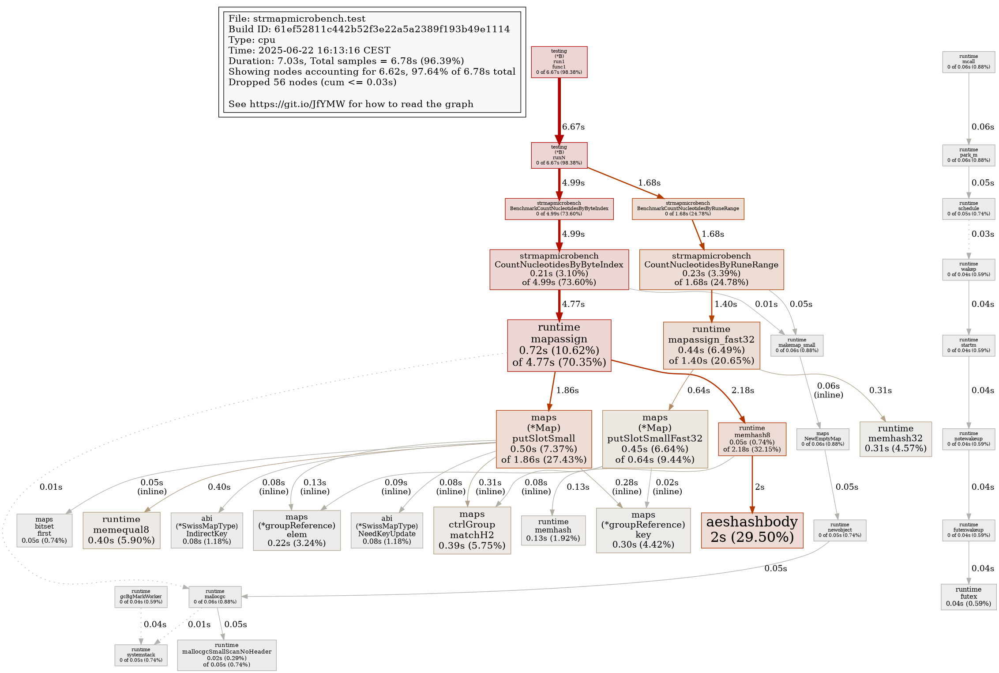

I was working through the [Go track on Exercism.org](https://exercism.org/tracks/go), and encountered an interesting performance puzzle on the **Nucleotide Count** exercise. The exercise seemed straightforward enough, but led me down a rabbit hole of microbenchmarking, ultimately uncovering an insight that goes far beyond string iteration.

## The Initial Question: Bytes or Runes?

Since the input for this exercise is a DNA sequence (a string of ASCII characters like `A`, `C`, `G`, and `T`), my first thought was to implement the counting logic using a `map` to track the frequency of each nucleotide.

With that out of the way, I reflexively started coding the `for` loop to iterate over the string using bytes (`for i := 0; i < len(s); i++`) as I recalled a [comment on r/golang](https://www.reddit.com/r/golang/) that emphasized how idiomatic and efficient it is to iterate by **bytes** when dealing with ASCII-only strings.

```go
package dna

import (
  "fmt"
)

type Histogram map[byte]int

func NewHistogram() Histogram {
  return Histogram{'A': 0, 'C': 0, 'G': 0, 'T': 0}
}

type DNA string

func (d DNA) Counts() (Histogram, error) {
  h := NewHistogram()

  for i := 0; i < len(d); i++ {
    if _, ok := h[d[i]]; !ok {
      return nil, fmt.Errorf("invalid nucleotide %q in DNA strand", d[i])
    }
    h[d[i]]++
  }

  return h, nil
}
```

## A Surprising Benchmark Result

I very much enjoy the “Dig Deeper” section of each exercise, and for this one, I noticed that the solution by `bobahop` actually [iterated over runes](https://exercism.org/tracks/go/exercises/nucleotide-count/approaches/switch-statement) (`for _, r := range s`) and even outperformed mine in microbenchmarks.

This was unexpected. Had I been lied to by stranger on Reddit?

I had assumed that rune iteration, which involves decoding UTF-8 characters, would incur more overhead than raw byte iteration. I knew my solution was also slower due to checking the existence of a key instead of using a `switch` statement, but I also tried `bobahop`’s solution with byte iteration, and found it performed worse than his original version, as he states on the exercism page.

```go
package dna

import "fmt"

type Histogram map[byte]int

type DNA string

const (
  nucA byte = 65
  nucC byte = 67
  nucG byte = 71
  nucT byte = 84
)

func (dna DNA) Counts() (Histogram, error) {
  results := Histogram{nucA: 0, nucC: 0, nucG: 0, nucT: 0}
  length := len(dna)
  for i := 0; i < length; i++ {
    nuc := dna[i]
    switch nuc {
    case nucA, nucC, nucG, nucT:
      results[nuc]++
    default:
      return nil, fmt.Errorf("invalid nucleotide '%c'", nuc)
    }
  }
  return results, nil
}
```

## My Initial Approach

I decided to create a dedicated repository to isolate and microbenchmark different implementations with varying iteration strategies.

I started with a simple problem: transcribing DNA to RNA.

```go
func TranscribeDnaToRnaBytes(dna string, rna []byte) {
  for i := range len(dna) {
    switch dna[i] {
    case 'A':
      rna[i] = 'U'
    case 'C':
      rna[i] = 'G'
    case 'G':
      rna[i] = 'C'
    case 'T':
      rna[i] = 'A'
    }
  }
}

func TranscribeDnaToRnaRunes(dna string, rna []rune) {
  for i, n := range dna {
    switch n {
    case 'A':
      rna[i] = 'U'
    case 'C':
      rna[i] = 'G'
    case 'G':
      rna[i] = 'C'
    case 'T':
      rna[i] = 'A'
    }
  }
}
```

As anticipated, my benchmarks showed that **byte iteration is slightly faster** than rune iteration.

```sh
$ go test -bench='^(BenchmarkTranscribeDnaToRnaBytes|BenchmarkTranscribeDnaToRnaRunes)$' -benchtime=1000000x -benchmem
goos: linux
goarch: amd64
pkg: github.com/pessolato/strmapmicrobench
cpu: 12th Gen Intel(R) Core(TM) i9-12900F
BenchmarkTranscribeDnaToRnaBytes-24      1000000               331.4 ns/op             0 B/op          0 allocs/op
BenchmarkTranscribeDnaToRnaRunes-24      1000000               529.3 ns/op             0 B/op          0 allocs/op
```

Next, I simplified the functions for counting nucleotides, in case there were other things the compiler was not liking about the original solution. I also modernized the for loop (`for i := range len(s)`) of the byte iteration.

```go
func CountNucleotidesByByteIndex(dna string) map[byte]int {
  chars := make(map[byte]int)
  for i := range len(dna) {
    chars[dna[i]]++
  }
  return chars
}

func CountNucleotidesByRuneRange(dna string) map[rune]int {
  chars := make(map[rune]int)
  for _, r := range dna {
    chars[r]++
  }
  return chars
}
```

However, the performance differences remained significant.

```sh
$ go test -bench='^(BenchmarkCountNucleotidesByByteIndex|BenchmarkCountNucleotidesByRuneRange)$' -benchtime=1000000x -benchmem
goos: linux
goarch: amd64
pkg: github.com/pessolato/strmapmicrobench
cpu: 12th Gen Intel(R) Core(TM) i9-12900F
BenchmarkCountNucleotidesByByteIndex-24          1000000              5191 ns/op             192 B/op          2 allocs/op
BenchmarkCountNucleotidesByRuneRange-24          1000000              1682 ns/op             192 B/op          2 allocs/op
PASS
ok      github.com/pessolato/strmapmicrobench   6.876s
```

At this point, I realized I needed more insight into what was happening under the hood. So, I turned to profiling.

## CPU Profiling Tells the Real Story

I profiled both functions for CPU and things began to make sense.



As shown, `CountNucleotidesByByteIndex` calls the generic `mapassign` function, which is significantly slower than the specialized `mapassign_fast32` function called by `CountNucleotidesByRuneRange`.

This led me to realize that I had been focused on **string iteration**, but the **map operations** were the real performance bottleneck. Specifically, the **type of map key** used has a surprisingly large impact.

### Internal Map Implementations in Go

Go’s runtime uses different internal functions for map assignment based on the key type:

* For smaller key types like `byte`, Go uses the slower, more generic, `mapassign` function.
* For the `int32` type (of which `rune` is an alias of), it uses optimized variants like `mapassign_fast32`.

This optimization for `int32` made the rune-based implementation significantly faster, despite the overhead of rune decoding.

I then implemented two more functions—one using `map[int16]int` and another that iterated through bytes but cast them to `rune` as keys:

```go
func CountNucleotidesByByteIndexAsRune(dna string) map[rune]int {
  chars := make(map[rune]int)
  for i := range len(dna) {
    chars[rune(dna[i])]++
  }
  return chars
}

func CountNucleotidesByByteIndexAsInt16(dna string) map[int16]int {
  chars := make(map[int16]int)
  for i := range len(dna) {
    chars[int16(dna[i])]++
  }
  return chars
}
```

Benchmark results:

```sh
$ go test -bench='^BenchmarkCountNucleotidesBy.*$' -benchtime=1000000x -benchmem
goos: linux
goarch: amd64
pkg: github.com/pessolato/strmapmicrobench
cpu: 12th Gen Intel(R) Core(TM) i9-12900F
BenchmarkCountNucleotidesByByteIndex-24                  1000000              5177 ns/op             192 B/op          2 allocs/op
BenchmarkCountNucleotidesByByteIndexAsRune-24            1000000              1648 ns/op             192 B/op          2 allocs/op
BenchmarkCountNucleotidesByByteIndexAsInt16-24           1000000              5132 ns/op             192 B/op          2 allocs/op
BenchmarkCountNucleotidesByRuneRange-24                  1000000              1670 ns/op             192 B/op          2 allocs/op
PASS
ok      github.com/pessolato/strmapmicrobench   13.631s
```

Interestingly, `int16` received no runtime optimization. Additionally, despite the casting overhead, `CountNucleotidesByByteIndexAsRune` outperformed `CountNucleotidesByRuneRange`, thanks to the faster byte iteration.

## Final Optimization: Arrays and Switches

Aware now of map-related overhead, I tried a more radical optimization. Since the set of nucleotides is small and fixed, I used a **fixed-size array** combined with a `switch` to track counts—bypassing maps entirely.

```go
func CountNucleotidesArrayBytes(dna string) map[byte]int {
  chars := [4]int{}
  for i := range len(dna) {
    switch dna[i] {
    case 'A':
      chars[0]++
    case 'C':
      chars[1]++
    case 'G':
      chars[2]++
    case 'T':
      chars[3]++
    }
  }
  return map[byte]int{
    'A': chars[0],
    'C': chars[1],
    'G': chars[2],
    'T': chars[3],
  }
}

func CountNucleotidesArrayRunes(dna string) map[rune]int {
  chars := [4]int{}
  for i := range dna {
    switch dna[i] {
    case 'A':
      chars[0]++
    case 'C':
      chars[1]++
    case 'G':
      chars[2]++
    case 'T':
      chars[3]++
    }
  }
  return map[rune]int{
    'A': chars[0],
    'C': chars[1],
    'G': chars[2],
    'T': chars[3],
  }
}
```

And the benchmark results:

```sh
$ go test -bench='^(BenchmarkCountNucleotidesArray.*|BenchmarkCountNucleotidesByByteIndexAsRune)$' -benchtime=1000000x -benchmem
goos: linux
goarch: amd64
pkg: github.com/pessolato/strmapmicrobench
cpu: 12th Gen Intel(R) Core(TM) i9-12900F
BenchmarkCountNucleotidesByByteIndexAsRune-24            1000000              1642 ns/op             192 B/op          2 allocs/op
BenchmarkCountNucleotidesArrayBytes-24                   1000000               412.9 ns/op           192 B/op          2 allocs/op
BenchmarkCountNucleotidesArrayRunes-24                   1000000               680.5 ns/op           192 B/op          2 allocs/op
PASS
ok      github.com/pessolato/strmapmicrobench   2.739s
```

The array-based solutions were substantially faster, confirming that eliminating map operations yields major performance benefits when the key space is small and predictable.

## Conclusion

This experience reinforced a crucial lesson: **Always benchmark and profile your code** when performance matters. Micro-optimizations like byte vs. rune iteration can make a difference, but their impact is often dwarfed by deeper runtime behaviors—such as the data structures you choose and how the Go runtime handles them internally.

### Key Takeaways

* **Byte iteration is faster than rune iteration**, but only marginally.
* **Map key types significantly affect performance**, due to Go’s use of specialized internal implementations.
* **Profiling is essential** to reveal hidden bottlenecks.
* For small, fixed-size key domains, **arrays** are often a better alternative to maps.

You can find the complete source code and benchmarks in the GitHub repository:
👉 [https://github.com/pessolato/strmapmicrobench](https://github.com/pessolato/strmapmicrobench)
